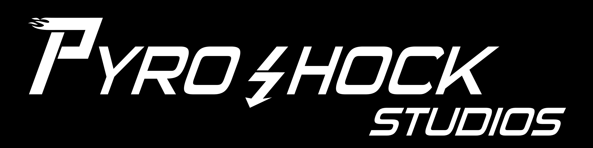

# Welcome to Shard Tech 4

*A game engine designed around performance, flexibility, and specialisation.*

# What is Shard Tech 4?
Shard Tech 4 (abbreviated as SDT4) is a high performance game engine built around modern graphics api's (Vulkan 1.3+, DirectX 12 Ultimate), with a wide hardware target in mind (GTX 900+, GCN 1.0+). With this, out of the box, comes static pipeline states (stutter free), full bindless and GPU driven rendering. Leveraging the efficiency of modern api's and graphics abstractions, this engine is aimed to be as robust and performant as possible.

C# .NET is used for scripting as it is a high performance and extremely versatile programming language, making use of modern programming concepts (nullability, async and await), as well as offering a very performant JIT runtime, targeting a variety of platforms. 

# Is it supported on my computer?
Yes! Shard Tech 4 has native support for 64 bit Windows and Linux operating systems, OSX support is work in progress, however development has been designed with multiple platforms in mind, and most underlying systems in the engine have already been designed for Mac support. 

For usage on Linux, it is not needed to compile from source! This is thanks to clever design choices that prioritised windowing system and GUI agnosticity (by using X11 and external modules for dialogues), so you can install it and make use of it immediately!. 