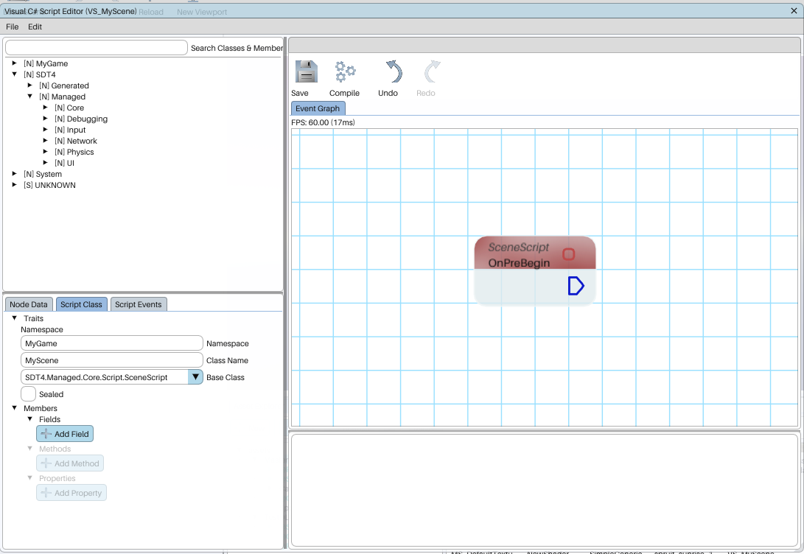
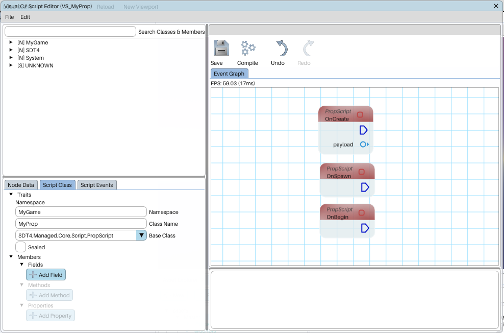

# SceneScript

Since we've had an extensive look at the [Scene](../../modules/sdt4.managed.core/scene.md) class, it is only natural to first make use of it.

## Making a SceneScript

Shard Tech 4 offers two methods of creating scene scripts:

- Written C# class
- Visual C# class

Both are perfectly valid methods of creating a class, the following is a [Visual Script](../../../editor/visualscript.md)



Equivalent written C# class:

```csharp

using SDT4.Managed.Core;
using SDT4.Managed.Core.Script;

namespace MyGame;

public class MyScene : SceneScript 
{
    protected override void OnPreBegin() 
    {

    }
}

```

Once `Scene.Start[Async]()` is called, `OnPreBegin()` is the first method called. additionally, `On[...]Tick()` may be called before the scene finished loading (once `OnPostBegin()` is invoked);

!!! tip
    See the [SceneScript](../../modules/sdt4.managed.core/script/scenescript.md) api reference for all possible overrides.


# Prop- and ActorScript

[PropScript](../../modules/sdt4.managed.core/script/propscript.md) and [ActorScript](../../modules/sdt4.managed.core/script/actorscript.md) are very similar, as they share the same overridable *events*. The key difference in that a [PropScript](../../modules/sdt4.managed.core/script/propscript.md) is [*Non-phaseable*](./phaseability.md#non-phaseable) while an [ActorScript](../../modules/sdt4.managed.core/script/actorscript.md) is [*Phaseable*](./phaseability.md#phaseable). 
## Making a Prop- and ActorScript
Shard Tech 4 akin to SceneScript, offers two methods of creating prop/actor scripts:

- Written C# class
- Visual C# class

[Visual Script](../../../editor/visualscript.md):



Written C# class:

```csharp

using SDT4.Managed.Core;
using SDT4.Managed.Core.Script;

namespace MyGame;

public class MyProp : PropScript 
{
    protected override void OnCreate(ScriptPayload payload) 
    {

    }

    protected override void OnSpawn() 
    {

    }

    protected override void OnBegin() 
    {

    }
}

```

## OnCreate vs OnBegin vs OnSpawn

These three look very similar in functionality, and may be called in close situations, however the use in which they are called is very different.

Once `Scene.Start[Async]()` is called, `OnCreate()` is called together with `OnBegin()` for persistent scripts (e.g. Actors present in the scene before `Scene.Start[Async]()` was called). OnSpawn() is only called when `Scene.CreatePrefabActor()` or `Scene.InvokeProp()` is explicitly called to spawn a script.

!!! tip
    See the [PropScript](../../modules/sdt4.managed.core/script/propscript.md) and [ActorScript](../../modules/sdt4.managed.core/script/actorscript.md) api reference for all possible overrides.
